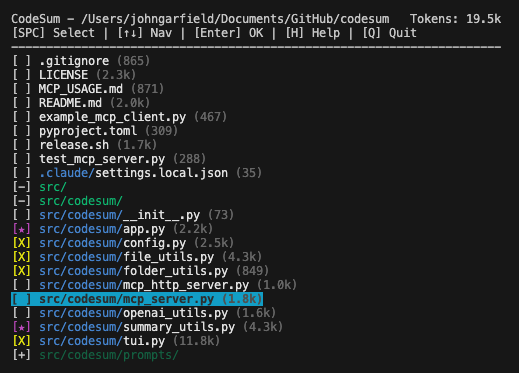

# CodeSum: Intelligent Code Context for LLMs

**Generate optimized code summaries that reduce token usage by 10-20x and deliver 4x faster results when working with AI coding assistants.**

CodeSum is a terminal-based tool that transforms your codebase into perfectly formatted context for Large Language Models. Through an interactive file selector, intelligent compression, and persistent configurations, CodeSum makes it effortless to provide your AI assistant with exactly the right code context—without the overhead.

## Why CodeSum?

Working with AI coding assistants typically involves one of two approaches:

1. **Agentic tools** that crawl your entire codebase, consuming massive token counts and taking significant time
2. **Manual context** where you copy-paste files, often missing critical dependencies or including irrelevant code

CodeSum solves both problems:

- **10-20x fewer tokens**: Selective file inclusion and optional AI compression dramatically reduce context size
- **75% faster**: Pre-generated summaries eliminate the need for agents to explore your codebase
- **Better results**: Focused, relevant context produces more accurate responses
- **Reusable configurations**: Save and recall file selections for different workflows
- **Zero learning curve**: Simple TUI with intuitive keyboard shortcuts and mouse support

## Version 0.3.0 Highlights

This release introduces major workflow improvements and a completely redesigned user experience:

### Per-File Compression
- Mark individual files for AI-powered compression with the `S` key
- Mix full-content and compressed files in a single summary
- Compressed files show with a distinct marker (★) and don't count toward token totals

### Selection Configuration Management
- Save named configurations of file selections and compression settings
- Full CRUD operations (Create, Read, Update, Delete) through an intuitive popup (press `M`)
- Instantly switch between different workflow contexts

### Enhanced Terminal Experience
- Complete mouse support: click to select, scroll to navigate
- Improved keyboard navigation with left/right arrows for folder jumping
- Graceful Ctrl+C handling that preserves state
- Comprehensive help system (press `H` or `?`)
- Beautiful exit screen with ASCII logo and summary statistics

### Streamlined Workflow
- No more API key prompts on startup—only when you use AI features
- Automatic clipboard copy with clear visual confirmation
- All selected files displayed in exit summary (no truncation)
- Lazy OpenAI client initialization for faster startup


## Installation

Requires Python 3.8 or higher.

```sh
pip install codesum
```

## Quick Start

1. Navigate to your project root:
   ```sh
   cd /path/to/your/project
   ```

2. Run CodeSum:
   ```sh
   codesum
   ```

3. Select files in the interactive TUI:
   - **Space**: Toggle file selection ([X] marker)
   - **S**: Mark file for compressed summary (★ marker)
   - **M**: Manage saved configurations
   - **H**: Show help with all keyboard shortcuts
   - **Enter**: Generate summary and copy to clipboard

4. Paste the clipboard content into your AI assistant

## Key Features

### Interactive TUI
- **Smart file selection** with folder expansion/collapse
- **Mouse support** for clicking and scrolling
- **Keyboard shortcuts** for efficient navigation
- **Token counting** displays exact context size
- **Responsive layout** adapts to terminal width



### Intelligent Summaries
- **Full-content summaries**: Complete code with project structure
- **AI compression**: Selective compression for large files (requires OpenAI API key)
- **Mixed mode**: Combine full and compressed content in one summary
- **Content hashing**: Cached summaries avoid redundant API calls

### Persistent State
- **Selection memory**: Remembers your file selections per project
- **Named configurations**: Save and recall different file selection sets
- **Folder collapse state**: Preserves your UI preferences
- **Custom ignore patterns**: Project-specific ignore rules

### Smart Filtering
- **Respects .gitignore**: Automatically excludes ignored files
- **Default ignore list**: Skips common directories (node_modules, venv, .git, etc.)
- **Custom ignore file**: Add project-specific patterns in `.summary_files/codesum_ignore.txt`

### Configuration Management
Set up your OpenAI API key (optional, only needed for AI compression):

```sh
codesum --configure
```

Configuration is stored in your user config directory:
- Linux: `~/.config/codesum/settings.env`
- macOS: `~/Library/Application Support/codesum/settings.env`
- Windows: `%APPDATA%\codesum\codesum\settings.env`

## TUI Keyboard Shortcuts

### Navigation
- **↑/↓**: Move selection up/down
- **←/→**: Jump to previous/next folder
- **PgUp/PgDn**: Page up/down
- **Mouse scroll**: Scroll through files

### Selection
- **Space**: Toggle file selection ([X] marker)
- **S**: Toggle compressed summary (★ marker)
- **F**: Toggle all files in current folder
- **A**: Select/deselect all files
- **E**: Expand all folders recursively
- **C**: Collapse all child folders recursively

### Management
- **M**: Open configuration management popup
  - **S**: Save current selection
  - **L**: Load configuration
  - **R**: Rename configuration
  - **D**: Delete configuration
- **H** or **?**: Show help
- **Enter**: Confirm and generate summary
- **Q** or **Esc**: Quit without saving


## Output Files

CodeSum creates a `.summary_files/` directory containing:

- **`code_summary.md`**: The generated summary (automatically copied to clipboard)
- **`previous_selection.json`**: Your last file selection
- **`selection_configs.json`**: Saved configuration presets
- **`collapsed_folders.json`**: UI state for folder collapse
- **`[filename]_metadata.json`**: Cached AI summaries with content hashes

## Development Installation

To install from source:

```sh
git clone https://github.com/sam1am/codesum.git
cd codesum
python3 -m venv venv
source venv/bin/activate  # On Windows: .\venv\Scripts\activate
pip install -e .
```

## Dependencies

- `openai` - OpenAI API client
- `tiktoken` - Token counting
- `pathspec` - gitignore parsing
- `python-dotenv` - Configuration management
- `pyperclip` - Clipboard operations
- `platformdirs` - Cross-platform config paths
- `windows-curses` - Windows terminal support (Windows only)
- `importlib-resources` - Resource loading (Python < 3.9 only)

## Use Cases

### Debugging Complex Issues
Select relevant modules and their tests, generate a summary, and provide focused context to your AI assistant. Results are more accurate because the model sees only what matters.

### Feature Implementation
Save a configuration with your feature's core files. Load it whenever working on that feature. No need to re-select files or provide redundant context.

### Code Reviews
Mark large files for compression while keeping critical files at full detail. Get concise summaries perfect for review discussions.

### Documentation
Use AI compression on implementation files while keeping API interfaces at full detail. Generate accurate documentation without token bloat.

## Performance Comparison

**Traditional Agentic Approach:**
- Agent crawls codebase: 150,000+ tokens
- Time to understand context: 2-3 minutes
- Cost per interaction: High

**CodeSum Approach:**
- Selective file inclusion: 15,000 tokens (10x reduction)
- Instant context availability: Pre-generated
- Cost per interaction: 10x lower
- Result quality: Superior due to focused context

## Video Tutorial

[](https://www.youtube.com/watch?v=IY-KIMyUaB8)

Note: Video shows earlier version. Current version (0.3.0) includes additional features like per-file compression, mouse support, and configuration management.

## License

MIT License - see LICENSE file for details

## Contributing

Contributions are welcome! Please feel free to submit issues, feature requests, or pull requests.

## Acknowledgements

Built with Python, OpenAI API, and the excellent libraries that make terminal UIs possible. Thanks to the open-source community for their continued support and contributions.
